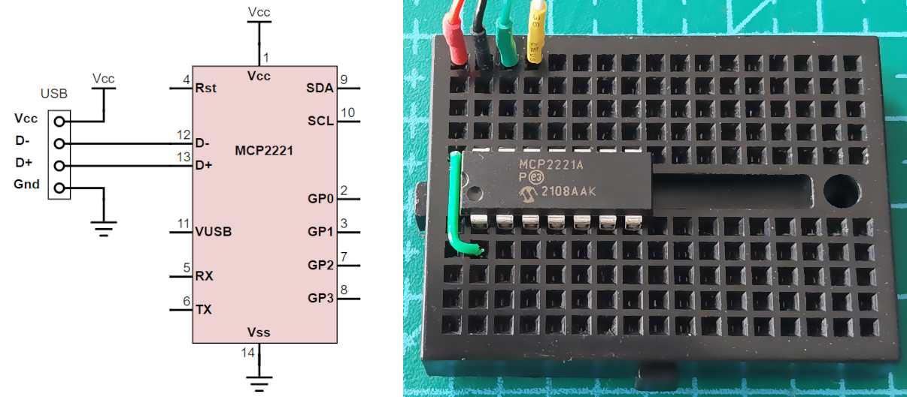
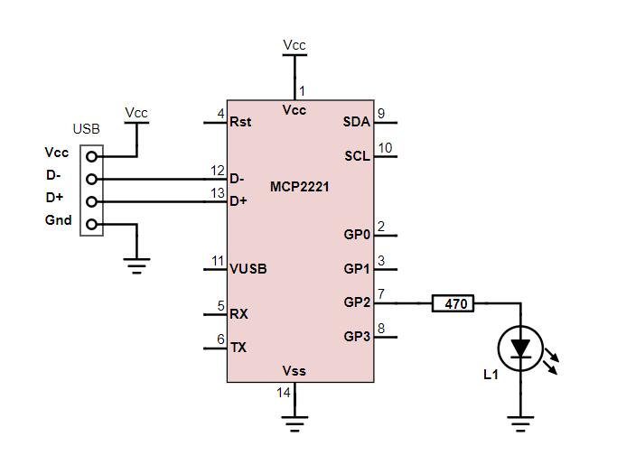
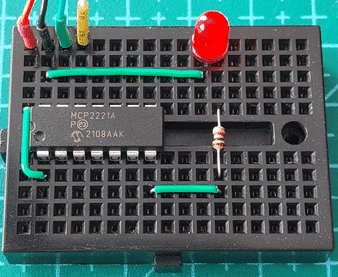
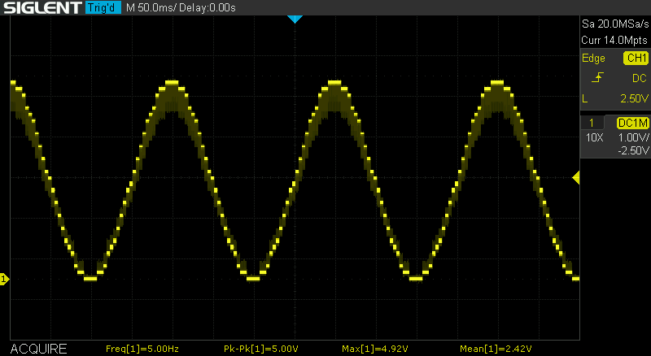
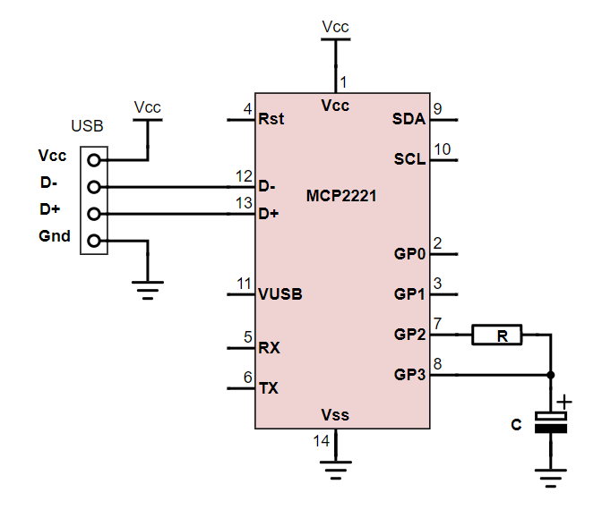
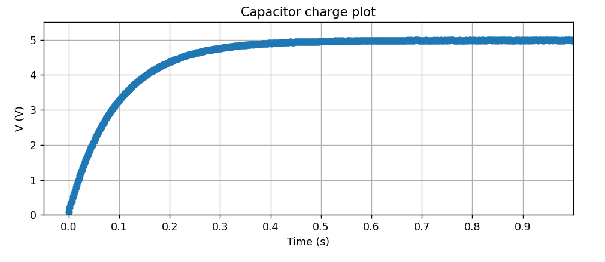
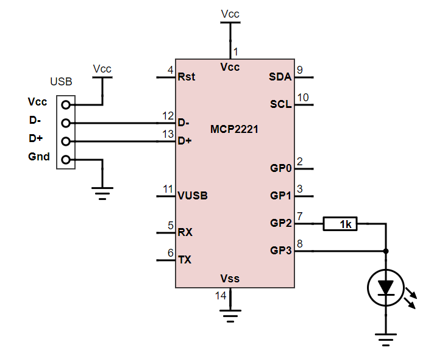
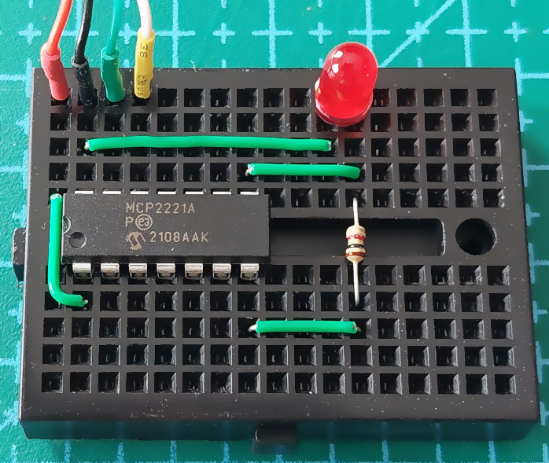
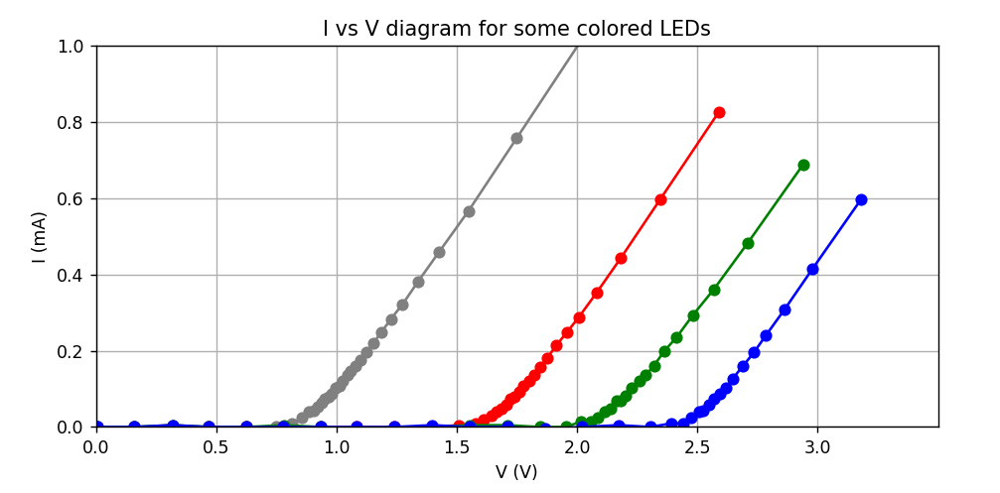
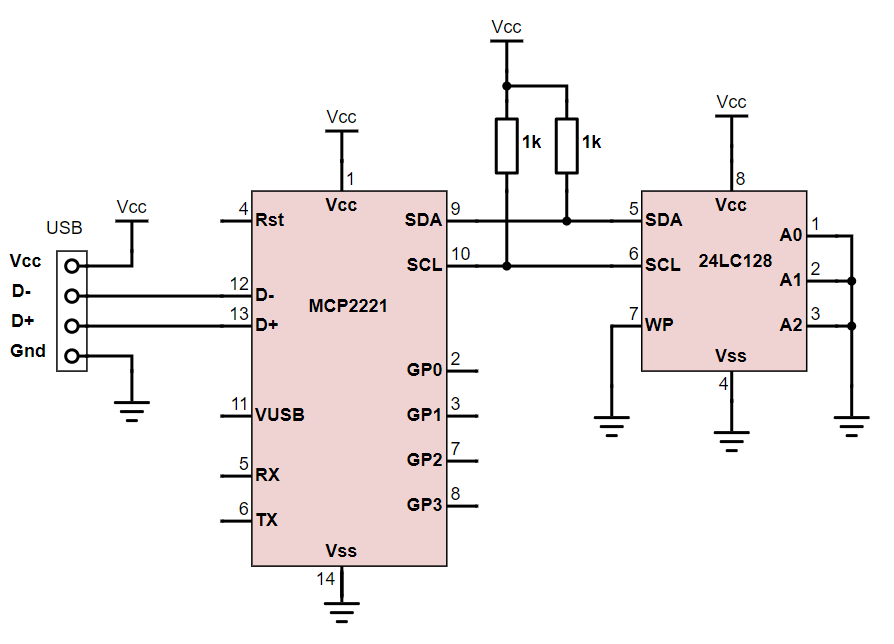

Examples
========

.. currentmodule:: EasyMCP2221

Getting started
---------------

Minimal components layout. This is not the recommended design, but it should work. See MCP2221's datasheet for more information.

To check the communication, import ``EasyMCP2221`` and create a new :class:`Device`. 

.. literalinclude:: ../../examples/device.py

The output should be like this:

.. code-block:: console

	MCP2221 is there!
	{
		"Chip settings": {
			"Power management options": "enabled",
			"USB PID": "0x00DD",
			"USB VID": "0x04D8",
			"USB requested number of mA": 100
		},
		"Factory Serial": "01234567",
		"GP settings": {},
		"USB Manufacturer": "Microchip Technology Inc.",
		"USB Product": "MCP2221 USB-I2C/UART Combo",
		"USB Serial": "0000000000"
	}

.. currentmodule:: EasyMCP2221.Device

Basic GPIO
----------

Configure pin function using :func:`set_pin_function` to GPIO_IN or GPIO_OUT. Then use :func:`GPIO_write` to change its output. Or :func:`GPIO_read` to read the status.

Digital output: LED blinking
~~~~~~~~~~~~~~~~~~~~~~~~~~~~~~~~

.. currentmodule:: EasyMCP2221.Device

Same as before, but use :func:`GPIO_write` in a loop to change its output periodically.

Schematic:

Breadboard:

Code:

.. literalinclude:: ../../examples/gpio_blink.py

Digital input: Mirror state
~~~~~~~~~~~~~~~~~~~~~~~~~~~~~~~~

In order to illustrate how to read from GPIO digital input, let's setup GP2 and GP3 to mimic the state of GP0 and GP1.

.. literalinclude:: ../../examples/gpio_mirror.py

Analog signals
--------------

ADC basics
~~~~~~~~~~~~~~~~~~~~~~~~~~~~~~~~

In this example, we setup GP1, GP2 and GP3 as analog inputs using :func:`set_pin_function`. Configure ADC reference with :func:`ADC_config` and lastly, read ADC values using :func:`ADC_read`.

It works better if you take off the LED and connect three potentiometers to the inputs.

Remember to **always put a 330 ohm resistor** right in series with any GP pin. That way, if you by mistake configured it as an output, the short circuit current won't exceed the 20mA.

.. literalinclude:: ../../examples/ADC.py

This is the console output when you move a variable resistor in GP3.

.. code-block:: console

	ADC0:  0.3%    ADC1:  0.2%    ADC2:  0.0%
	ADC0:  0.3%    ADC1:  0.1%    ADC2:  0.0%
	ADC0:  0.3%    ADC1:  0.2%    ADC2:  9.9%
	ADC0:  0.2%    ADC1:  0.1%    ADC2: 21.7%
	ADC0:  0.3%    ADC1:  0.3%    ADC2: 31.7%
	ADC0:  0.2%    ADC1:  0.0%    ADC2: 38.2%
	ADC0:  0.4%    ADC1:  0.3%    ADC2: 45.5%
	ADC0:  0.2%    ADC1:  0.0%    ADC2: 52.3%
	ADC0:  0.3%    ADC1:  0.3%    ADC2: 56.2%
	ADC0:  0.1%    ADC1:  0.0%    ADC2: 58.8%
	ADC0:  0.4%    ADC1:  0.2%    ADC2: 61.6%
	ADC0:  0.1%    ADC1:  0.0%    ADC2: 64.6%
	ADC0:  0.3%    ADC1:  0.2%    ADC2: 67.1%
	ADC0:  0.2%    ADC1:  0.2%    ADC2: 70.4%
	ADC0:  0.3%    ADC1:  0.1%    ADC2: 74.5%
	ADC0:  0.2%    ADC1:  0.1%    ADC2: 79.2%
	ADC0:  0.2%    ADC1:  0.1%    ADC2: 80.6%

Mixed signal: level meter
~~~~~~~~~~~~~~~~~~~~~~~~~~~~~~~~

We will use the analog level in GP3 to set the state or three leds connected to GP0, GP1 and GP2.

.. literalinclude:: ../../examples/level_meter.py

DAC: LED fading
~~~~~~~~~~~~~~~~~~~~~~~~~~~~~~~~

We use :func:`DAC_config` and :func:`DAC_write` to make a LED (connected to GP3 or GP2) to fade-in and fade-out with a triangular wave.

.. literalinclude:: ../../examples/DAC.py

Advanced analog
---------------

Sinusoidal generator
~~~~~~~~~~~~~~~~~~~~

DAC's resolution is 5 only bit.

Maximum update rate is 500Hz. High frequency output noise can be greatly reduced using a simple RC low pass filter.

.. figure:: img/DAC_sin_5Hz_lowpass.png

Code:

Notice the usage of ``time.perf_counter()`` instead of ``sleep`` to get a more or less constant rate in a multitask operating system. 

.. literalinclude:: ../../examples/DAC_sin.py

Capacitor charge
~~~~~~~~~~~~~~~~

A GPIO output can be used to charge or discharge a capacitor through a resistor while we are sampling ADC values at regular intervals:

This is a classic capacitor charge curve:

Code:

.. literalinclude:: ../../examples/V_T_plot_C.py

LED curve plotter
~~~~~~~~~~~~~~~~~

We can read ADC values while we play with DAC output in order to characterize some part.

Note that the DAC output impedance is 5k (according to the datasheet), so you can't draw much intensity from it unless using an output buffer.

The breadboard connections are pretty straightforward:

This is the output for an infrared, red, green and blue LEDs.

Code:

.. literalinclude:: ../../examples/V_I_plot.py

I2C bus
----------

I2C bus scan
~~~~~~~~~~~~~~~~~~~~~~~~~~~~~~~~

We will use :func:`I2C_read` to send a read command to any possible I2C address in the bus. The moment we get an acknowledge, we know there is some slave connected.

To make this example work, you need to get an EEPROM (e.g. 24LC128) and connect it properly to the SCA and SCL lines, as well as power supply.

.. literalinclude:: ../../examples/I2C_scan.py

This is my output:

.. code-block:: console

	$ python I2C_scan.py
	Searching...
	I2C slave found at address 0x50

Write to an EEPROM
~~~~~~~~~~~~~~~~~~~~~~~~~~~~~~~~

In this example, we will use :func:`I2C_write` to write some string in the first memory position of an EEPROM.

.. literalinclude:: ../../examples/EEPROM_write.py

Result:

.. code-block:: console

    $ python EEPROM_write.py
    Tell me a phrase: This is an example.
    Saved to EEPROM.

Read from an EEPROM
~~~~~~~~~~~~~~~~~~~~~~~~~~~~~~~~

Same as before but reading

We seek the first position writing ``0x0000``, then :func:`I2C_read` 100 bytes and print until the first null.

.. literalinclude:: ../../examples/EEPROM_read.py

Output:

.. code-block:: console

    $ python EEPROM_read.py
    Phrase stored was: This is an example.

I2C Slave helper
----------------

:class:`EasyMCP2221.I2C_Slave.I2C_Slave` class allows you to interact with I2C devices in a more object-oriented way.

.. literalinclude:: ../../examples/I2C_Slave_example.py

Output:

.. code-block:: console

	$ python I2C_Slave_example.py
	Storing...
	Data:
	[78, 78, 78, 78, 82, 102, 81, 31, 56, 77]

