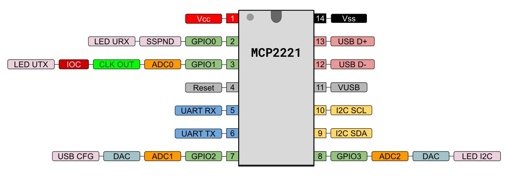

=====================================================
Easy MCP2221
=====================================================

EasyMCP2221 is the most complete **Python** module to interface with Microchip MCP2221 and MCP2221A.

The MCP2221 is a fully integrated USB-to-UART/I2C serial converter with four GP pins providing miscellaneous functionalities.

MCP2221's peripherals:
    - 4 General Purpose Input/Output (GPIO) pins
    - 3 channel 10 bit ADC
    - One 5 bit DAC
    - I2C
    - UART
    - Clock Output with PWM
    - One interrupt detection flag
    - USB remote Wake-up

With this chip and this library you can practice the basics of digital electronics, microcontrollers, and robotics with a regular computer and regular Python. See :doc:`examples`.

This is MCP2221 and **MCP2221A pinout**:

Disclaimer
----------

I am not related to Microchip Inc. in any way. This library is unofficial and for personal use only.

Some examples in this documentation show bare connections from your USB port to a breadboard. Most USB port controllers are protected against short-circuit between power and/or data lines, but some are not. I am not responsible for any damage you may cause to your computer. To be safe, always use an isolated powered USB hub for experimentation.

Many thanks to Microchip for providing free samples of MCP2221A, and for openly publishing the datasheet and documentation used to write this library.

MIT License
-----------

Copyright (c) 2023 Reinoso Guzman

Permission is hereby granted, free of charge, to any person obtaining a copy
of this software and associated documentation files (the "Software"), to deal
in the Software without restriction, including without limitation the rights
to use, copy, modify, merge, publish, distribute, sublicense, and/or sell
copies of the Software, and to permit persons to whom the Software is
furnished to do so, subject to the following conditions:

The above copyright notice and this permission notice shall be included in all
copies or substantial portions of the Software.

THE SOFTWARE IS PROVIDED "AS IS", WITHOUT WARRANTY OF ANY KIND, EXPRESS OR
IMPLIED, INCLUDING BUT NOT LIMITED TO THE WARRANTIES OF MERCHANTABILITY,
FITNESS FOR A PARTICULAR PURPOSE AND NONINFRINGEMENT. IN NO EVENT SHALL THE
AUTHORS OR COPYRIGHT HOLDERS BE LIABLE FOR ANY CLAIM, DAMAGES OR OTHER
LIABILITY, WHETHER IN AN ACTION OF CONTRACT, TORT OR OTHERWISE, ARISING FROM,
OUT OF OR IN CONNECTION WITH THE SOFTWARE OR THE USE OR OTHER DEALINGS IN THE
SOFTWARE.

.. toctree::
   :maxdepth: 1
   :caption: Table of Contents
   :hidden:

   install
   examples
   gui
   api_reference
   i2c_slave
   smbus
   limitations_bugs
   internals
   history
   links
