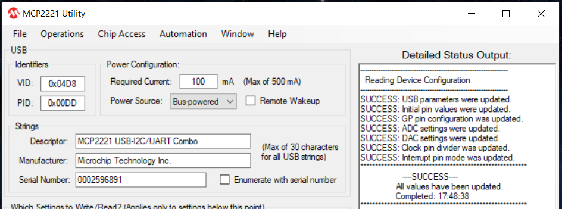

Install / troubleshooting
==========================

Regular installation via PIP
----------------------------

Pip command for Linux:

.. code-block:: console

    $ pip install EasyMCP2221

On Linux, additional steps may be required. See *Troubleshooting* section below.

Pip command for Windows:

.. code-block:: console

    > py -m pip install EasyMCP2221

Troubleshooting
---------------

Device not found
~~~~~~~~~~~~~~~~

First step, try to use any of the Microchip's official tools to verify that everything is working fine.

On Linux, use ``lsusb`` to find any device with ID ``04D8:xxxx``:

.. code-block:: console

    $ lsusb
    Bus 001 Device 004: ID 04d8:00dd Microchip Technology, Inc.
    ...

Hidapi backend error
~~~~~~~~~~~~~~~~~~~~

EasyMCP2221 depends on ``hidapi``, which in fact needs some backend depending on OS. Sometimes this is troublesome.

If you get an error like this:

.. code-block:: console

    ImportError: Unable to load any of the following libraries:libhidapi-hidraw.so libhidapi-hidraw.so.0 libhidapi-libusb.so libhidapi-libusb.so.0 libhidapi-iohidmanager.so libhidapi-iohidmanager.so.0 libhidapi.dylib hidapi.dll libhidapi-0.dll

Try to install the following packages using ``pip``:

- libusb
- libusb1

If that doesn't work, try manually installing libhidapi from https://github.com/libusb/hidapi/releases.

Sometimes, yo need to manually copy ``libusb-1.0.dll`` to ``C:\Windows\System32``. It used to be in ``C:\Users\[username]\AppData\Local\Programs\Python\Python39\Lib\site-packages\libusb\_platform\_windows\x64\libusb-1.0.dll`` or similar path.

Open failed for non-root users (Linux)
~~~~~~~~~~~~~~~~~~~~~~~~~~~~~~~~~~~~~~

On **Linux**, only root can open these devices. Trying to run the software without privileges will raise the following error:

.. code-block:: console

    $ python3 pruebas.py
    Traceback (most recent call last):
      File "pruebas.py", line 7, in <module>
        mcp = EasyMCP2221.Device(trace_packets = False)
      File "/home/pi/EasyMCP2221/EasyMCP2221/MCP2221.py", line 82, in __init__
        self.hidhandler.open_path(hid.enumerate(VID, PID)[devnum]["path"])
      File "hid.pyx", line 142, in hid.device.open_path
    OSError: open failed

To change that, you need to add a udev rule. Create a new file under ``/etc/udev/rules.d/99-mcp.rules`` with this content:

.. code-block:: text

    SUBSYSTEM=="usb", ATTRS{idVendor}=="04d8", MODE="0666", GROUP="plugdev"

Delay at the end of script (Linux)
~~~~~~~~~~~~~~~~~~~~~~~~~~~~~~~~~~

If you experience delays on script startup or exit, use ``lsmod`` to check for conflicting drivers.

.. code-block:: console

    # lsmod | grep hid
    hid_mcp2221            20480  1
    hid_generic            16384  0
    usbhid                 57344  0
    hid                   139264  3 usbhid,hid_generic,hid_mcp2221

This library may conflict with ``hid_mcp2221`` kernel module.

To blacklist this module, create a file named ``/etc/modprobe.d/blacklist-mcp2221.conf`` with this content:

.. code-block:: text

    blacklist hid_mcp2221

Run ``rmmod hid_mcp2221`` to unload the module.

Local installation and testing
------------------------------

You may want to install this library from a cloned GitHub repository, usually for testing or development purposes.

First create and activate a new virtual environment. Update pip if needed.

.. code-block:: console

    > python -m venv init easymcp_dev
    > cd easymcp_dev
    > Scripts\activate
    > python -m pip install --upgrade pip

Then, clone the home repository inside that virtual environment and perform the
installation in *editable* (``-e``) mode.

.. code-block:: console

    $ git clone https://github.com/electronicayciencia/EasyMCP2221

    $ pip install -e EasyMCP2221

If you get this error: *"File "setup.py" not found. Directory cannot be installed in editable mode"*, update PIP.

.. code-block:: console

    > python -m pip install --upgrade pip

If you get this one: *"EasyMCP2221 does not appear to be a Python project: neither 'setup.py' nor 'pyproject.toml' found."*, please check working directory. You must be in the root of the cloned GitHub repository.

Local documentation
~~~~~~~~~~~~~~~~~~~

This is an optional step. To compile documentation locally you will need ``sphinx`` and ``RTD theme``.

.. code-block:: console

    pip install -U sphinx
    pip install -U sphinx_rtd_theme

Compilation:

.. code-block:: console

    cd docs
    make html

Main HTML file is *EasyMCP2221/docs/build/html/index.html*.

Testing
~~~~~~~

There is a test suite to check ADC, DAC, I2C, and some other features like start-up and persistence after a reset.

In order to pass the tests, you need a working MCP2221 or MCP2221A and a serial EEPROM 24LC128 or bigger. Use the following schematic:

**GP0** and **GP1** are used to test I2C in several scenarios. **GP3** is used as a DAC. **GP2**, connected to a simple RC low pass filter, is used as an ADC to test different voltaje references.

Run all tests:

.. code-block:: console

    $ python -m unittest

Run specific test suite, verbose and fail-fast:

.. code-block:: console

    $ python -m unittest test.test_gpio -fv

