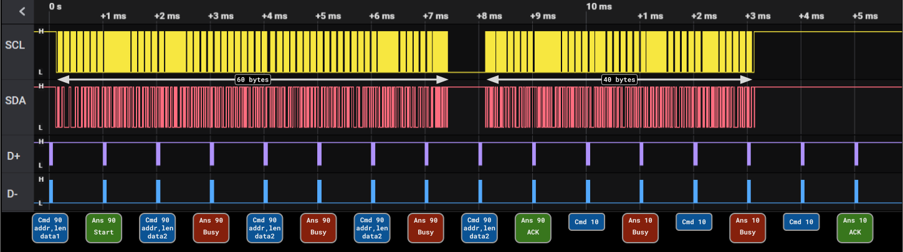
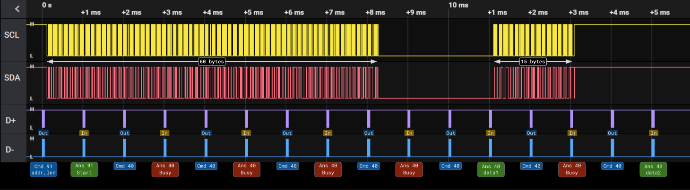
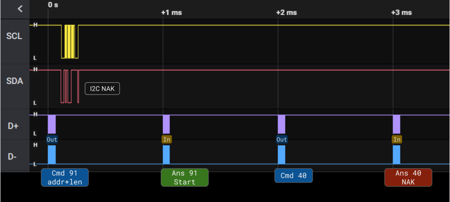

Internal details
=================

I2C transfers
-------------

In USB, every transaction is initialized by the host. At the beginning of any transaction, it sends a frame indicating if it is an **output** (the host sending data to the slave), or an **input** (the host expects for slave to send data).

In *full speed* mode, the maximum length of a data payload is 64 bytes.

Write transfer
~~~~~~~~~~~~~~

    Timeline of a 100 bytes I2C **write**. Open the image in a new tab to see it full size.

While the I2C engine is sending ``data1``, subsequent write commands fail and are ignored. Only when ``data1`` has already been sent, the device does respond with OK and proceed to send ``data2``.

Read transfer
~~~~~~~~~~~~~~

	Timeline of a 75 bytes I2C **read**. Open the image in a new tab to see it full size.

While the MCP2221 is reading bytes, subsequent calls to *Read I2C data buffer* (40) will fail. When the buffer is ready (or full), the call succeed, the data is returned and the reading of next chunk begins.

Transfer failure
~~~~~~~~~~~~~~~~

Note that since the USB host only send or requests data at fixed intervals of 1 ms, the state of the last issued command may or may not match the actual state of the I2C transfer.

For example, in a read operation to a nonexistent device. The I2C transfer starts and even ends before the response to the write command ``91`` is read.

   
    I2C read failure. Not acknowledge.

Moreover, like in the above successful reading, the *I2C read command* (91) succeed but the *I2C read data command* (40) fails, exactly as before.

I use internal I2C engine status code to differentiate between both cases. Unfortunately, not all the states are fully documented.

