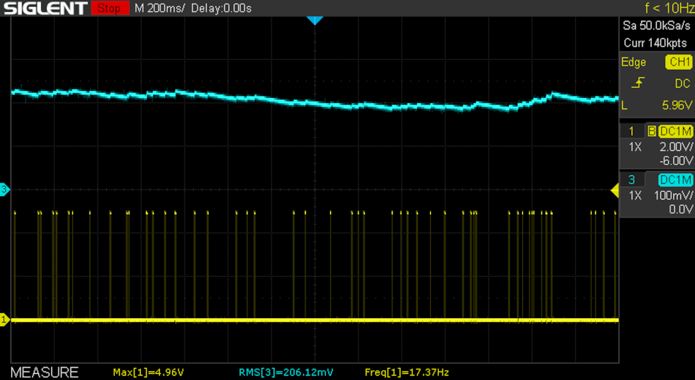
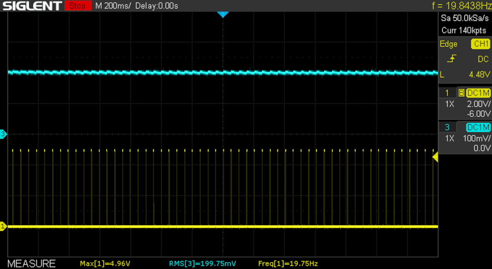

# Bit-banged PWM on GP0.

Different approaches to generate 4% output.

## Pure PWM

Set GP0 On in 4 out of 100 slots in a row. Off the rest.

- *On* slots together
- Output is stable
- Noticeable ripple
- Fixed frequency

## Random PWM

GP0 has 4% chance of being On, and Off the rest.

- *On* slots randomly distributed
- Output fluctuates a lot
- No ripple
- Random frequency

## Averaged PWM

Calculate moving average. If below 4% turn GP0 On.

- *On* slots evenly distributed
- Output is stable
- Minimum ripple
- Actual frequency depends on output voltage

